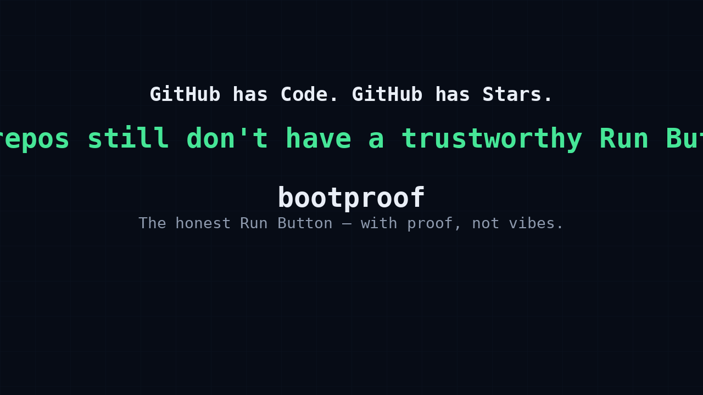

# bootproof

> **The honest Run Button for repos — with proof, not vibes.**

<p align="center">
  
</p>


GitHub has a **Code** button.  
GitHub has a **Star** button.  
But software still does not have a trustworthy **Run** button.

`bootproof` is the open-source local Run Button for repositories.

It takes a repo from cold start to observed boot, then writes a signed attestation proving what actually happened.

No fake green checks.  
No guessed localhost URLs.  
No invented secrets.  
No silent `.env` mutation.  
No “works on my machine” theatre.

If it boots, `bootproof` proves it.  
If it fails, `bootproof` tells you why.

---

## The problem

Open-source has a trust problem.

AI has made it easy to generate entire repositories that look complete.  
READMEs can be polished.  
Demos can be convincing.  
CI badges can be shallow.  
Install instructions can rot.  
Generated apps can look finished but fail on first boot.

Every developer still discovers the truth the slow way:

```bash
git clone ...
npm install
npm run dev
```

Then the real debugging begins.

Wrong package manager.  
Missing environment variables.  
Broken scripts.  
Port conflicts.  
Database auth failures.  
Stale docs.  
Monorepo ambiguity.  
A README that says “just run it” when it does not run.

`bootproof` exists for one simple question:

> **Can this repository actually boot from a clean start?**

Not theoretically.  
Not according to the README.  
Not according to an agent summary.  
Actually.

---

## The idea

Runnability should be a verifiable property of a repository.

A repo should be able to carry proof that it booted.

Not a promise.  
Not a screenshot.  
Not a decorative badge.  
Not a maintainer claim.

A signed, local, per-run execution receipt.

```bash
bootproof up ./some-repo
```

Or, for the canonical cold-clone scenario:

```bash
npx bootproof https://github.com/user/repo
```

`bootproof` inspects the repo, builds a safe run plan, starts only what it can honestly start, observes a real health signal, classifies failures, and writes a signed attestation.

The Run Button is the product.

The proof is the moat.

The registry is how it compounds.

---

## What success looks like

```text
BootProof

Repo: github.com/user/repo
Mode: cold clone

Install       ✓ npm ci completed
Env           ✓ .env.bootproof.example written (your .env untouched)
Run           ✓ npm run dev started
Observe       ✓ http://127.0.0.1:3000 returned 200
Proof         ✓ signed attestation written

Verdict: BOOTS
First-run time: 48s
```

If the repo does not boot, `bootproof` does not pretend.

```text
BootProof

Repo: github.com/user/repo
Mode: cold clone

Install       ✓ npm ci completed
Env           ✓ .env.bootproof.example written (your .env untouched)
Run           ✗ npm run dev failed
Class         missing_env
Evidence      DATABASE_URL is required but no safe value was available

Verdict: DOES NOT BOOT
First-run time: 31s
```

A failed run is still useful.

It tells the truth.

---

## The honesty contract

`bootproof` is built around a hard honesty contract.

- Real `.env` files are **never** written.
- Secrets are **never** invented.
- Unknown commands are **rejected**, not guessed.
- Monorepo ambiguity is **surfaced**, not hidden.
- Skipped steps are **never** rendered as success.
- Library packages are not mislabelled as applications.
- Dry runs say what they *would* do; they do not claim proof.
- Positive boot claims require observed evidence.
- No telemetry.
- No hidden upload.
- No background network writes.
- No silent patching of your project.

When environment scaffolding is needed, `bootproof` writes a namespaced file:

```text
.env.bootproof.example
```

It does not write:

```text
.env
```

That rule is contract-level, test-enforced behaviour.

---

## Quick start

For local development:

```bash
npm ci
npm run build
npm link
```

Run against a local repo:

```bash
bootproof up ./path-to-repo
```

Run against a remote repo:

```bash
npx bootproof https://github.com/user/repo
```

Explain an attestation:

```bash
bootproof explain .bootproof/attestation.json
```

Verify an attestation:

```bash
bootproof verify .bootproof/attestation.json
```

---

## What `bootproof` writes

`bootproof` writes namespaced artefacts only.

```text
.bootproof/
  attestation.json
  public-key.json
  run.log

.env.bootproof.example
```

It does not overwrite your app configuration.

It does not mutate your real `.env`.

It does not hide uncertainty by patching the repo until something appears to work.

If the run cannot be performed safely, `bootproof` refuses and explains why.

---

## Attestations

A `bootproof` attestation is a signed execution receipt.

It records:

- the repository tested
- the commit or local state
- the detected stack
- the install command
- the run command
- the observed health signal
- the verdict
- the failure class, if any
- the first-run time
- the tool version
- the signature

Example:

```json
{
  "tool": "bootproof",
  "version": "0.1.0-alpha",
  "repo": "github.com/user/repo",
  "commit": "abc123",
  "mode": "cold_clone",
  "verdict": "boots",
  "observed": {
    "health_url": "http://127.0.0.1:3000",
    "status": 200
  },
  "timing": {
    "first_run_seconds": 48
  },
  "signature": {
    "algorithm": "ed25519"
  }
}
```

If the file is tampered with, verification fails.

That is the point.

---

## Why this is different from CI

CI normally answers:

> Did the maintainer’s workflow pass?

`bootproof` answers:

> Can a stranger boot this repository from a clean start?

Those are different questions.

CI can pass while the README is wrong.  
CI can pass while the first-run path is broken.  
CI can pass while the demo cannot start.  
CI can pass while the repo is hostile to new contributors.

`bootproof` is focused on the first adoption truth:

> **Can I run it?**

---

## Why this matters for AI agents

AI coding agents need an execution oracle.

They can edit files.  
They can generate apps.  
They can open pull requests.  
They can claim success.

But without execution proof, they are guessing.

`bootproof` gives agents a simple rule:

```text
No proof, no green check.
```

An agent can run:

```bash
bootproof up .
```

Then attach the signed attestation to a PR.

The maintainer no longer has to trust the agent’s summary.  
They can inspect the proof.

This makes `bootproof` useful for:

- autonomous coding agents
- generated application scaffolds
- repo repair agents
- pull request validation
- open-source maintainers
- enterprise code intake
- vendor due diligence
- supply-chain review

In the AI era, code is abundant.

Proof is scarce.

---

## The registry model

The long-term value of `bootproof` is not one signed file.

Signed receipts are useful.  
A federated proof registry is what makes them compound.

The registry is intentionally Git-native.

A repository can carry its own runnability history:

```text
repo
└── .bootproof
    └── attestation.json
```

A CI Action can refresh that proof on every push.

A verified index can aggregate attestations across thousands of repositories.

A failure corpus can compound into better detectors, clearer fixes, and sharper run plans.

This creates a public, portable record of what actually boots.

No central SaaS is required for the primitive to work.

The repo is the write path.

Git is the distribution layer.

The ecosystem becomes the database.

---

## Badges, but only as proof pointers

`bootproof` should never create decorative trust badges.

A badge is only acceptable if it is a dumb pointer to a live, verifiable attestation.

That means:

- green only when the committed proof verifies for the current commit
- grey when the proof is stale
- red when verification fails
- always linked to the underlying attestation
- never used as a standalone claim

A badge is not the proof.

The attestation is the proof.

---

## Failure taxonomy

`bootproof` does not just say “failed”.

It classifies failure.

Examples include:

- `not_an_application`
- `unknown_command`
- `missing_env`
- `install_failed`
- `run_failed`
- `healthcheck_failed`
- `port_unavailable`
- `monorepo_ambiguous`
- `postgres_auth_failed`
- `docker_unavailable`
- `timeout`
- `unsafe_local_required`

Instead of:

```text
Something went wrong.
```

You get:

```text
Failure class: postgres_auth_failed
Evidence: password authentication failed for user "postgres"
Suggested next step: check DATABASE_URL or local Postgres credentials
```

This is how failed runs become useful data.

---

## Security model

`bootproof` uses Ed25519 signatures for attestations.

A signed attestation proves what `bootproof` observed during a specific run.

Current trust model:

```text
local signing / trust on first use
```

That is useful, but not final.

The roadmap includes GitHub Actions and OIDC-backed signing so a verifier can distinguish:

```text
signed by a developer laptop
```

from:

```text
signed by a clean CI runner for this repository
```

That matters.

A local attestation is a receipt.

A CI-backed attestation becomes a stronger supply-chain artefact.

---

## Why not just let GitHub build this?

GitHub could ship a Run Button.

That is the obvious platform risk.

`bootproof` is designed around three defenses:

1. **Neutrality**  
   `bootproof` can work across GitHub, GitLab, Bitbucket, local repos, private repos, enterprise hosts, and air-gapped environments.

2. **Open attestation format**  
   Proof should live with the repo, not inside one platform’s UI.

3. **Corpus head-start**  
   Every run, failure class, CI refresh, and committed proof improves the registry and the detectors.

This is not an invincible moat.

It is a practical one.

The goal is to make `bootproof` the open standard for proving that software boots.

---

## What `bootproof` is not

`bootproof` is not a deployment platform.

It is not a general CI replacement.

It is not a cloud runner.

It is not an AI agent.

It is not a magic environment fixer.

It is not a tool that mutates your project until it appears to work.

It is a proof layer for the most basic software claim:

> **This repository boots.**

---

## Current status

`bootproof` is early alpha.

Current focus:

- Node.js app detection
- safe local execution
- healthcheck observation
- signed attestations
- verification
- explanation
- redaction
- failure classification
- registry export
- Windows / WSL2 path handling
- zero runtime dependencies

Near-term roadmap:

- cold-clone URL support
- fully containerised app execution
- Python support
- Go support
- GitHub Action integration
- GitHub OIDC-backed attestations
- multi-service health checks
- proof-linked badges
- public verified index

Unsupported stacks should fail clearly, not magically.

---

## Philosophy

When code was scarce, writing code was the hard part.

When AI makes code abundant, proving code works becomes the hard part.

The future will have more generated repos, more automated PRs, more synthetic demos, and more confident claims than any developer can manually verify.

`bootproof` is a small primitive for that world.

A local Run Button.

A refusal to fake success.

A signed receipt when something actually works.

A growing registry of what really boots.

---

## One-line version

```text
bootproof is the honest Run Button for repos: it runs a project from cold start and writes cryptographic proof of whether it actually booted.
```

---

## The rule

```text
No proof, no green check.
```

---

## License

Apache-2.0
